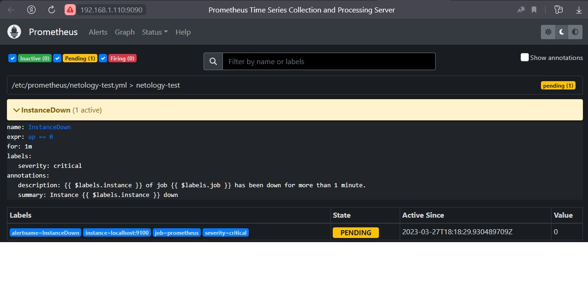
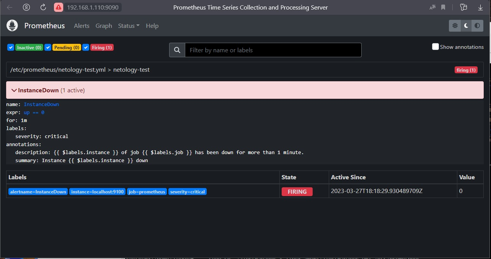
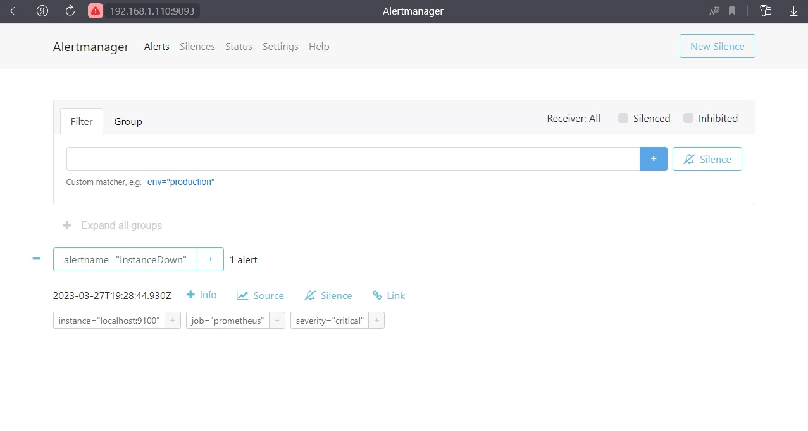
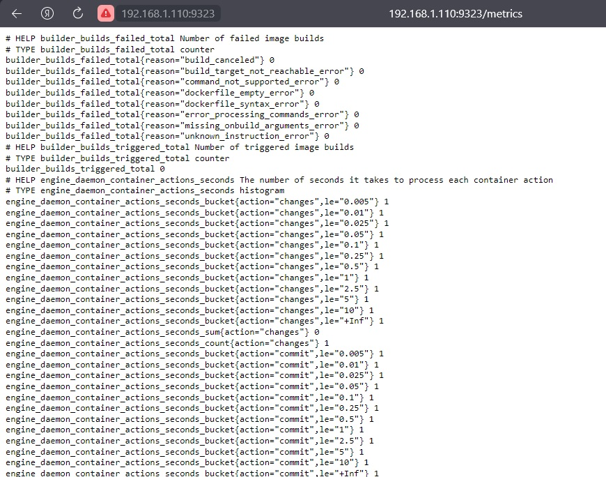
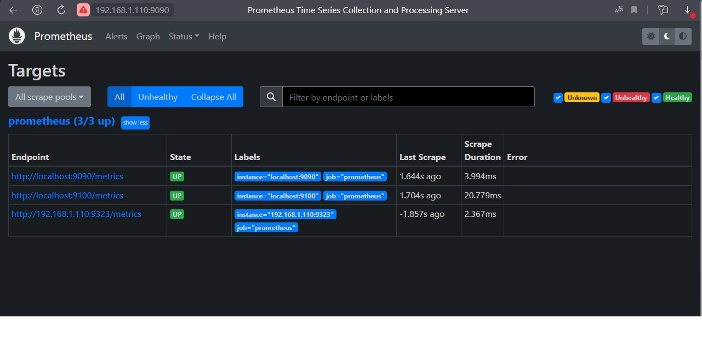
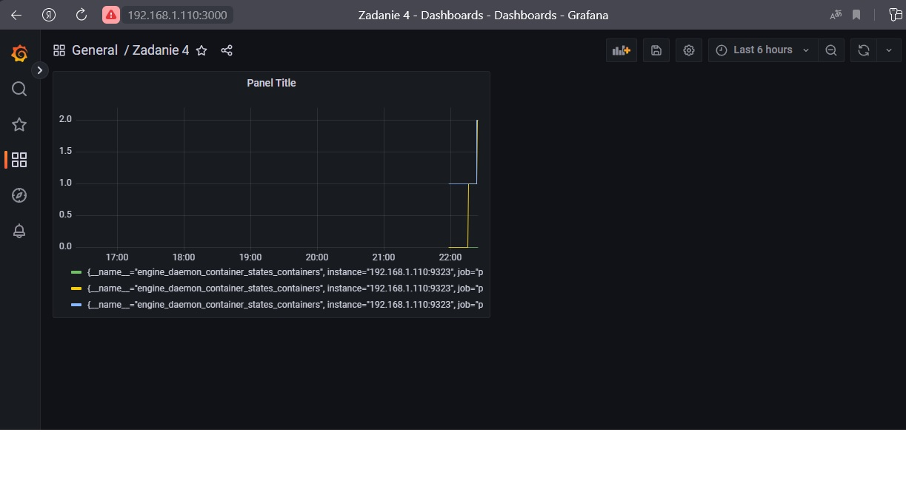

# Домашнее задание к занятию "`9.5 «Prometheus. Часть 2»`" - `Дьяконов Алексей`

### Задание 1. Создание файла с правилом оповещения.

- 1.` Создаём файл: `

```
    sudo nano /etc/prometheus/netology-test.yml

    groups: # Список групп
    - name: netology-test # Имя группы
      rules: # Список правил текущей группы
      - alert: InstanceDown # Название текущего правила
        expr: up == 0 # Логическое выражение
        for: 1m # Сколько ждать отбоя предупреждения перед отправкой оповещения
        labels:
         severity: critical # Критичность события
        annotations: # Описание
         description: '{{ $labels.instance }} of job {{ $labels.job }} has been down for more than 1 minute.' # Полное   описание алерта
         summary: Instance {{ $labels.instance }} down # Краткое описание алерта
```

- 2.` Добавим в файле /etc/prometheus/prometheus.yml в раздел rule_files - "netology-test.yml" '   `

   
- 3.`Перезапускаем Prometheus`

```
    sudo systemctl restart prometheus
    systemctl status prometheus
```

##### Страница Alert после остановки Node Exporter

-


### Задание 2. Установка Alertmanager.

- 1.`Скачиваем c и разархивируем архив`

```
    wget https://github.com/prometheus/alertmanager/releases/download/v0.25.0-rc.2/alertmanager-0.25.0-rc.2.linux-amd64.tar.gz
    tar -xvf alertmanager-*linux-amd64.tar.gz
```

- 2.`Копируем файлы в папки`

```
    sudo cp ./alertmanager-*.linux-amd64/alertmanager /usr/local/bin
    sudo cp ./alertmanager-*.linux-amd64/amtool /usr/local/bin
    sudo cp ./alertmanager-*.linux-amd64/alertmanager.yml /etc/prometheus
```

- 3.`Назначаем права`

```
    sudo chown -R prometheus:prometheus /etc/prometheus/alertmanager.yml
```

- 4.`Создаём сервис`

```
    nano /etc/systemd/system/prometheus-alertmanager.service

    [Unit]
    Description=Alertmanager Service
    After=network.target
    [Service]
    EnvironmentFile=-/etc/default/alertmanager
    User=prometheus
    Group=prometheus
    Type=simple
    ExecStart=/usr/local/bin/alertmanager --config.file=/etc/prometheus/alertmanager.yml --storage.path=/var/lib/prometheus/alertmanager $ARGS
    ExecReload=/bin/kill -HUP $MAINPID
    Restart=on-failure
    [Install]
    WantedBy=multi-user.target
```

- 5.`Запускаем сервис`

```
    sudo systemctl enable prometheus-alertmanager
    sudo systemctl start prometheus-alertmanager
    sudo systemctl status prometheus-alertmanager
```
##### Подключаем Alertmanager  к Prometheus   

- 6.`Добавляем в сonfig-файл Prometheus подключение к Alertmanager `

```
    sudo nano /etc/prometheus/prometheus.yml

    alerting:
     alertmanagers:
     - static_configs:
       - targets: # Можно указать как targets: [‘localhost”9093’]
         - localhost:9093
```

- 7.`Перезапускаем Prometheus`

```
    sudo systemctl restart prometheus
    systemctl status prometheus
```

##### Настраиваем оповещения в Alertmanager

- 7.`правим конфиг Alertmanager`
```
    sudo nano /etc/prometheus/alertmanager.yml

    global:
    route:
     group_by: ['alertname'] # Параметр группировки оповещений - по имени
     group_wait: 30s # Сколько ждать восстановления, перед тем как отправить первое оповещение.
     group_interval: 10m # Сколько ждать перед тем как дослать оповещение о новых сработках по текущему алерту.
     repeat_interval: 60m # Сколько ждать перед тем как отправить повторное оповещение
     receiver: 'email' # Способ которым будет доставляться текущее оповещение
    receivers: # Настройка способов оповещения
    - name: 'email'
      email_configs:
      - to: 'yourmailto@todomain.com'
        from: 'yourmailfrom@fromdomain.com'
        smarthost: 'mailserver:25'
        auth_username: 'user'
        auth_identity: 'user'
        auth_password: 'paS$w0rd'
```

- 8.`Перезапускаем и отключаем экспортер для проверки`

```
    sudo systemctl restart prometheus-alertmanager
    systemctl status prometheus-alertmanager
    sudo systemctl stop node-exporter
    systemctl status node-exporter
```

##### Страница Alert Prometheus

-

##### Правило Alertmanager

-


### Задание 3. Создание экспортера метрик в Docker и подключение его  к Prometheus.

- 1.`Создаём  daemon.json`

    nano /etc/docker/daemon.json
    {
     "metrics-addr" : "ip_нашего_сервера:9323",
     "experimental" : true
    }

#### Внимание ' , ' - важно!

- 2.`Перезапускаем docker`

```
    sudo systemctl restart docker && systemctl status docker
```

##### Добавляем endpoint Docker в Prometheus 

#### Страница работает только http://ip_нашего_сервера:9323/metrics

- 3.`Добавляем в сonfig-файл Prometheus новый endpoint`

```
    sudo nano /etc/prometheus/prometheus.yml

    static_configs:
    - targets: ['localhost:9090', 'localhost:9100', 'server_ip:9323']   
```

- 2.`Перезапускаем Prometheus`

```
    sudo systemctl restart prometheus
    systemctl status prometheus
```

-
-


### Задание 4. Создание дашборда Grafana для Docker (порт 3000).

- 1.`+ New dashboard > Add new panel`

- 2.`Metrics выберите: engine > engine_daemon_container_states_containers`

- 3.`Run query`

#### Не забывать нажать на сохранение


-

